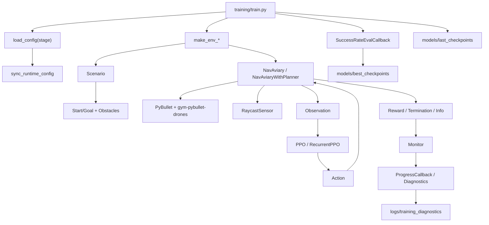

# Полное описание кода проекта

Этот документ объясняет, как устроен проект, какие файлы за что отвечают и как данные проходят через систему: от генерации карты и запуска PyBullet-среды до обучения PPO/RecurrentPPO, оценки, диагностики и визуализации.

Документ написан так, чтобы его можно было читать без опыта в reinforcement learning. Если встречается технический термин, рядом дается простое объяснение.

## 1. Назначение проекта

Проект реализует обучение дрона навигации в 3D-среде PyBullet. Агент должен долететь от стартовой точки до цели, избегая границ арены и препятствий.

Основные режимы:

- `stage 0` - пустая арена, базовое обучение навигации.
- `stage 1` - статические цилиндрические препятствия, опционально с RRT* планировщиком.
- `pretrain` - набор разнообразных карт: цилиндры, сферы, стены, балки, ворота, слалом, город, стройплощадка, динамические препятствия. В этом режиме планировщик отключен, агент учится локальному обходу сам.

Основные технологии:

- `gym-pybullet-drones` - физическая модель Crazyflie-дрона и базовая RL-среда.
- `PyBullet` - физическая симуляция, препятствия, столкновения, raycast-сенсор.
- `stable-baselines3` - PPO, векторные среды, `VecNormalize`, callbacks.
- `sb3-contrib` - опциональный `RecurrentPPO` с LSTM.
- `numpy/scipy/matplotlib/pandas` - математика, RRT*, графики и отчеты.

## 2. Словарь простыми словами

Этот раздел лучше прочитать первым. Он объясняет слова, которые часто встречаются в коде.

### Агент

Агент - это обучаемая программа, которая управляет дроном. В проекте агентом является нейросеть PPO/RecurrentPPO.

Пример: агент получает наблюдение `obs`, выбирает действие `action`, среда применяет это действие к дрону.

### Среда / environment / env

Среда - это "игровой мир", в котором летает дрон. Она знает:

- где находится дрон;
- где находится цель;
- где стены и препятствия;
- столкнулся ли дрон;
- какую награду дать за текущий шаг.

Главная среда проекта - `NavAviary` в `envs/nav_aviary.py`.

### Эпизод / episode

Эпизод - одна попытка долететь до цели.

Эпизод начинается с `reset()`, когда создаются старт, цель и препятствия. Эпизод заканчивается, когда:

- дрон долетел до цели;
- дрон столкнулся;
- дрон вышел за границы;
- закончилось максимальное число шагов.

### Шаг / step

Шаг - одно действие дрона.

На каждом шаге происходит такой цикл:

```text
наблюдение -> нейросеть -> действие -> физика -> награда -> новое наблюдение
```

В коде это метод `env.step(action)`.

### Observation / наблюдение

Наблюдение - числа, которые получает нейросеть. Она не "видит картинку", а получает вектор чисел:

- где цель относительно дрона;
- какая скорость у дрона;
- какая высота;
- какой yaw-поворот;
- каким было прошлое действие;
- что показывают raycast-лучи;
- дополнительные признаки для торможения около цели.

В pretrain сейчас observation имеет 57 чисел.

### Action / действие

Action - команда, которую нейросеть дает среде:

```text
[vx, vy, vz, yaw_rate]
```

Простыми словами:

- `vx` - лететь вперед/назад относительно корпуса дрона;
- `vy` - лететь вправо/влево;
- `vz` - лететь вверх/вниз;
- `yaw_rate` - поворачиваться вокруг вертикальной оси.

Все значения сначала идут в диапазоне от `-1` до `1`, а потом среда переводит их в реальные скорости.

### Reward / награда

Reward - число, которое говорит агенту, хорошо он поступил или плохо.

Примеры:

- приблизился к цели - получил плюс;
- летит в сторону цели - получил плюс;
- крутится на месте - получил минус;
- близко к стене - получил минус;
- столкнулся - большой минус;
- долетел до цели - большой плюс.

PPO учится выбирать такие действия, чтобы суммарная награда за эпизод была больше.

### Terminated и truncated

Это два способа закончить эпизод.

- `terminated` - эпизод закончился по смысловой причине: успех, столкновение, выход за границы.
- `truncated` - эпизод оборвался по лимиту времени/шагов.

### Scenario / сценарий

Scenario - генератор карты. Он решает:

- где поставить старт;
- где поставить цель;
- какие препятствия создать;
- как двигать динамические препятствия.

Примеры:

- `Stage0Scenario` - пустая карта;
- `Stage1Scenario` - карта с цилиндрами;
- `StagePretrainScenario` - много разных типов карт.

### Obstacle / препятствие

Obstacle - объект в PyBullet, с которым дрон может столкнуться или который он может увидеть raycast-лучами.

Примеры:

- цилиндр;
- сфера;
- стена;
- балка;
- куб;
- движущаяся машина;
- качающаяся палка.

### PyBullet

PyBullet - физический движок. Он считает:

- движение дрона;
- столкновения;
- raycast-лучи;
- положение препятствий.

Можно думать о нем как о "симуляторе физики".

### gym-pybullet-drones

Это библиотека, где уже есть физическая модель дрона Crazyflie и базовая RL-среда. Проект не пишет физику моторов с нуля, а расширяет готовый класс `BaseRLAviary`.

### PPO

PPO - алгоритм обучения с подкреплением. Простыми словами: метод, который постепенно улучшает нейросеть по результатам многих попыток.

В проекте PPO учится так:

1. пробует летать;
2. получает награды и штрафы;
3. обновляет нейросеть;
4. снова пробует летать лучше.

### RecurrentPPO

RecurrentPPO - версия PPO с памятью LSTM.

Обычный PPO принимает решение только по текущему observation. RecurrentPPO может учитывать несколько прошлых шагов, то есть "помнить" недавнюю ситуацию. Это полезно для динамических препятствий.

### LSTM

LSTM - тип нейросетевой памяти. В этом проекте LSTM помогает политике не забывать, что происходило несколько шагов назад.

### Policy / политика

Policy - нейросеть, которая выбирает действие.

Формула простыми словами:

```text
policy(observation) -> action
```

### VecNormalize

`VecNormalize` нормализует наблюдения и награды, чтобы обучение было стабильнее.

Очень важно: при запуске уже обученной модели нужно загружать не только `.zip` модели, но и соответствующий `.pkl` файл нормализации. Иначе модель будет получать числа в другом масштабе и может летать плохо.

### SubprocVecEnv и DummyVecEnv

Это обертки stable-baselines3 для запуска сред.

- `SubprocVecEnv` запускает несколько сред в отдельных процессах. Это быстрее для обучения.
- `DummyVecEnv` запускает среду в текущем процессе. Это проще и нужно для GUI/watch-режима.

### Monitor

`Monitor` - обертка, которая записывает информацию об эпизодах: reward, длину эпизода, success/crash flags.

### Callback

Callback - объект, который stable-baselines3 вызывает во время обучения.

В проекте callbacks нужны, чтобы:

- печатать прогресс;
- сохранять лучший checkpoint;
- запускать оценку;
- писать диагностику.

### Checkpoint

Checkpoint - сохраненное состояние модели. Обычно состоит из:

- `.zip` - веса нейросети;
- `.pkl` - статистика `VecNormalize`.

### Raycast

Raycast - "луч", который выпускается из дрона и проверяет, есть ли впереди препятствие.

В проекте 20 лучей смотрят в разные стороны. Если луч быстро попал в объект, значит рядом опасность.

### RRT*

RRT* - алгоритм планирования пути. Он строит дерево случайных точек в пространстве и ищет маршрут от старта к цели без столкновений.

В проекте RRT* используется только для stage0/stage1 planner-mode. Для pretrain он отключен.

### Waypoint

Waypoint - промежуточная точка пути.

Если RRT* построил путь, агент не летит сразу к финальной цели. Он летит к текущему waypoint, потом к следующему, и так до цели.

### Safety shield

Safety shield - дополнительный фильтр действий. Если дрон слишком близко к препятствию, shield может подправить действие: притормозить или добавить движение от опасности.

Для обучения с нуля shield часто выключают, чтобы агент сам учился поведению. Для визуализации или проверки его можно включить.

### Body-frame и world-frame

Это два способа описывать направление.

`World-frame` - координаты мира. Например, ось X всегда смотрит в одну и ту же сторону арены.

`Body-frame` - координаты относительно корпуса дрона. Например, "вперед" означает туда, куда сейчас смотрит нос дрона, даже если он повернулся.

В проекте action задается в body-frame, потому что агенту проще думать: "лети вперед/вправо/вверх", а не "лети по мировой оси X/Y/Z".

### Yaw

Yaw - поворот вокруг вертикальной оси. Для дрона это поворот носа вправо или влево.

`yaw_rate` - скорость такого поворота.

### PID-контроллер

PID-контроллер - классический регулятор, который помогает физическому дрону двигаться к заданной позиции/ориентации. Нейросеть не управляет моторами напрямую. Она говорит желаемую скорость, а PID уже переводит это в команды моторам.

### Seed

Seed - число для генератора случайностей. Если поставить тот же seed, карта и случайные выборы будут повторяться более предсказуемо. Это нужно для сравнения экспериментов.

### TensorBoard

TensorBoard - инструмент для просмотра графиков обучения: reward, loss, success rate и других метрик.

### JSONL

JSONL - файл, где каждая строка является отдельным JSON-объектом. Такой формат удобен для длинных логов: можно дописывать новые строки после каждого эпизода.

### Artifact / артефакт

Артефакт - результат запуска программы. Например:

- сохраненная модель;
- файл нормализации;
- JSON-отчет;
- картинка графика;
- screenshot карты.

### Debug / diagnostics

Diagnostics - подробные логи, которые помогают понять, почему агент не долетает:

- часто ли он врезается;
- часто ли улетает за границы;
- зависает ли рядом с целью;
- слишком ли быстро летит;
- какие компоненты reward помогают или мешают.

## 3. Верхнеуровневая структура

```text
.
├── config/                 # Конфиги стадий, наград, PPO, runtime-sync
├── envs/                   # Gym/PyBullet среды, raycast-сенсор, препятствия
├── scenarios/              # Генераторы карт: stage0, stage1, pretrain
├── planners/               # RRT* планировщик и утилиты waypoints
├── training/               # Обучение, оценка, curriculum, графики
├── visualization/          # GUI-визуализация, screenshots, карты, сравнения
├── tests/                  # Тесты runtime config, observations, rewards, RRT*
├── models/                 # Сохраненные модели и нормализация
├── logs/                   # TensorBoard, eval history, diagnostics
├── reports/                # JSON-оценки, картинки карт, training plots
├── COMMANDS.md             # Быстрые команды
├── PARAMETERS_GUIDE.md     # Старый/частично устаревший гайд по параметрам
├── requirements.txt        # Зависимости
└── quickstart.sh           # Интерактивный quick start
```

Важно: папки `models/`, `logs/`, `reports/` в основном содержат артефакты запусков, а не исходный код.

## 4. Главный поток выполнения

Типичный запуск обучения:

```bash
python training/train.py --stage pretrain --obstacle-type cylinders --algo recurrent_ppo --eval
```

Поток внутри кода:

1. `training/train.py` парсит аргументы командной строки.
2. Загружается stage-config через `config.load_config(...)`.
3. Для `pretrain` дополнительно применяются override-параметры выбранной карты через `apply_pretrain_obstacle_overrides(...)`.
4. `sync_runtime_config(...)` копирует stage-параметры в runtime-модуль `config`, чтобы worker-процессы `SubprocVecEnv` видели те же константы.
5. Создаются функции окружений `make_env_stage0`, `make_env_stage1` или `make_env_pretrain`.
6. Среды заворачиваются в `SubprocVecEnv` или `DummyVecEnv` для GUI/watch-режима.
7. Поверх сред создается или загружается `VecNormalize`.
8. Создается/загружается PPO или RecurrentPPO.
9. `model.learn(...)` запускает обучение.
10. `ProgressCallback` собирает метрики эпизодов.
11. `TrainingDiagnosticsLogger` пишет JSONL-диагностику.
12. `SuccessRateEvalCallback`, если включен `--eval`, периодически оценивает модель и сохраняет лучший checkpoint.
13. В конце сохраняются `last_checkpoints`, опционально main-model и/или лучший checkpoint.

## 5. Конфигурация

### 4.1 `config/base.py`

Базовый конфиг для всех режимов:

- частоты симуляции: `PYB_FREQ = 240`, `CTRL_FREQ = 30`;
- длина эпизода: `MAX_STEPS = 1200`;
- ограничения действий: `VX_MAX`, `VY_MAX`, `VZ_MAX`, `YAW_RATE_MAX`;
- raycast-сенсор: `N_RAYS = 20`, `RAY_LENGTH = 5.0`;
- число параллельных сред: `N_ENVS = 8`;
- гиперпараметры PPO в `PPO_PARAMS`;
- награды и штрафы: success/crash/timeout, progress, velocity, heading, proximity, boundary, smoothness, yaw penalty;
- safety shield: опциональный фильтр действий рядом с препятствиями.

### 4.2 `config/stage0.py`

Пустая арена:

- размер `15 x 15 x 5` м;
- минимальная дистанция старт-цель `8` м;
- параметры RRT*: `RRT_MAX_ITER`, `RRT_STEP_SIZE`, `RRT_GOAL_BIAS`, `RRT_REWIRE_RADIUS`.

### 4.3 `config/stage1.py`

Статические препятствия:

- тот же размер арены `15 x 15 x 5` м;
- `STAGE1_N_OBSTACLES = (8, 12)`;
- радиусы цилиндров `0.25..0.50`;
- высота цилиндров `2.5..5.0`;
- отдельные параметры RRT*.

### 4.4 `config/pretrain.py`

Самый важный конфиг текущего проекта. Он задает компактный коридор и набор карт:

- базовая арена `4 x 12 x 3` м;
- физические стены арены включены: `PHYSICAL_ARENA_WALLS = True`;
- расширенное наблюдение включено: `USE_ENHANCED_OBS = True`;
- старт и цель выбираются в специальных зонах на концах коридора;
- RRT* отключен: `USE_PLANNER = False`;
- скорости выше базовых: `VX_MAX = 2.4`, `VY_MAX = 2.4`, `VZ_MAX = 1.6`;
- награда за успех усилена до `REWARD_SUCCESS = 3000.0`;
- добавлены тонкие штрафы/бонусы для поведения около цели: near-goal progress, stall, away, speed, capture;
- настроены ограничения генерации карт: clearance, spacing, feasibility checks;
- `OBSTACLE_TYPES` описывает все семейства препятствий.

Крупные карты (`city_dynamic`, `construction_site_dynamic`) имеют `config_overrides`: увеличивают арену, дальность raycast, длину эпизода и зоны старта/цели.

### 4.5 `config/__init__.py`

Содержит:

- `load_config(stage)` - возвращает модуль `stage0`, `stage1` или `pretrain` и добавляет debug-поля.
- `apply_pretrain_obstacle_overrides(cfg, obstacle_type)` - создает `SimpleNamespace` с override-полями для конкретной pretrain-карты.

### 4.6 `config/runtime_sync.py`

Решает важную проблему: часть кода читает глобальный модуль `config`, а stage-config находится в отдельном модуле. В `SubprocVecEnv` каждый worker импортирует `config` заново. Поэтому `sync_runtime_config(stage_config)` копирует все uppercase-поля из stage-config в runtime `config`.

## 6. Сценарии карт

Сценарий отвечает за выбор старта/цели и создание препятствий.

### 5.1 `scenarios/base_scenario.py`

Абстрактный базовый класс:

- хранит `rng`, `seed`, списки `obstacles` и `dynamic_obstacles`;
- задает интерфейс `generate(...)`, `reset(...)`;
- умеет обновлять динамические препятствия через `update_dynamic_obstacles(dt)`;
- умеет чистить препятствия;
- содержит базовый `_generate_start_goal()` для stage0/stage1;
- содержит `_check_clearance(...)`.

Особенность: базовая генерация использует глобальный `config`, поэтому для корректности stage0/stage1 важен runtime sync.

### 5.2 `scenarios/stage0_empty.py`

`Stage0Scenario`:

- загружает `load_config('0')`;
- препятствий нет;
- `generate/reset` возвращают только старт и цель.

### 5.3 `scenarios/stage1_static.py`

`Stage1Scenario`:

- загружает `load_config('1')`;
- генерирует случайное число цилиндров;
- не ставит препятствия слишком близко к старту/цели;
- дополнительно старается не перекрывать прямой путь старт-цель;
- использует `StaticObstacle` из `envs/obstacles.py`.

### 5.4 `scenarios/pretrain_obstacles.py`

Это библиотека классов препятствий:

- `CylinderObstacle` - статический цилиндр.
- `SphereObstacle` - сфера с синусоидальным движением.
- `WallObstacle` - прямоугольная стена.
- `BeamObstacle` - балка, может качаться по yaw/pitch/roll.
- `BoxObstacle` - статический box/building/block.
- `MovingBoxObstacle` - движущийся прямоугольник, например машина/груз/платформа.
- `SwingingStickObstacle` - капсула-палка, может качаться или двигаться по высоте.

Все классы создают PyBullet collision/visual shape и имеют `update(...)` или `cleanup(...)`.

### 5.5 `scenarios/stage_pretrain.py`

`StagePretrainScenario` - самый сложный генератор карт.

Основные обязанности:

- принимает `obstacle_type`: `random`, `dynamic_mix`, `cylinders`, `beams`, `city_dynamic` и т.д.;
- применяет per-map override-конфиг;
- выбирает конкретный тип карты через `_resolve_obstacle_type()`;
- генерирует старт/цель в коридорных зонах через `_generate_start_goal_zones()`;
- может смещать цель к краям, но соблюдает `GOAL_WALL_CLEARANCE`;
- создает препятствия через `_generate_obstacles(...)`;
- валидирует, что старт и цель не попали внутрь препятствий;
- обновляет динамические препятствия на каждом шаге.

Семейства карт:

- `empty` - без препятствий.
- `cylinders` - столбы; есть проверка связности 2D-прохода через inflated occupancy grid.
- `spheres` - движущиеся сферы.
- `crossing_spheres` - сферы, пересекающие коридор по X.
- `walls` - стены.
- `beams` - качающиеся балки.
- `boxes` - статические блоки.
- `gates` - стены с проходами.
- `slalom` - чередующиеся блоки.
- `city_blocks` - мини-город с улицей.
- `city_dynamic` - динамический город: здания, провода, машины, птицы.
- `construction_site_dynamic` - стройплощадка: каркасы, краны, грузы, транспорт, лифты, трубы, debris.
- `swinging_sticks` - качающиеся палки.

## 7. Среда обучения

### 6.1 `envs/nav_aviary.py`

`NavAviary` наследуется от `gym_pybullet_drones.envs.BaseRLAviary` и реализует RL-среду навигации.

#### Инициализация

В `__init__` среда:

- принимает `scenario`, `gui`, `fixed_map`, `show_trajectory`, `num_drones`;
- берет размеры арены из `scenario.config`;
- поддерживает single-drone и swarm-mode;
- создает `RaycastSensor`;
- вызывает `BaseRLAviary` с `DroneModel.CF2X`, `ObservationType.KIN`, `ActionType.VEL`;
- отключает тяжелые GUI overlays для скорости.

#### Действие

Action space:

```text
[vx, vy, vz, yaw_rate] в диапазоне [-1, 1]
```

В `_preprocessAction(...)` нормированное действие переводится в физическую цель:

1. масштабируется через `VX_MAX`, `VY_MAX`, `VZ_MAX`, `YAW_RATE_MAX`;
2. скорость считается в body-frame;
3. переводится в world-frame через quaternion дрона;
4. опционально ограничивается возле границ арены;
5. опционально замедляется возле цели;
6. превращается в target position + target yaw;
7. PID-контроллер из `gym-pybullet-drones` считает RPM моторов.

#### Safety shield

`_apply_safety_shield_single(...)` может фильтровать action:

- смотрит ближайшие raycast-лучи;
- если препятствие ближе `SAFETY_SHIELD_SOFT_CLEARANCE`, добавляет вектор избегания;
- если ближе hard-clearance, убирает компоненту скорости в сторону препятствия;
- снижает yaw при риске;
- учитывает стены/пол/потолок.

По умолчанию в базовом конфиге shield выключен, но включается флагами `--safety-shield` или в визуализации.

#### Наблюдение

Базовый observation:

```text
goal_body_norm(3)
dist_to_goal_norm(1)
velocity_body_norm(3)
height_norm(1)
yaw_norm(1)
prev_action(4)
raycasts(20)
```

Итого базово: `13 + 20 = 33` признака.

Если `USE_ENHANCED_OBS = True`, добавляются:

```text
radial_speed_to_goal(1)
lateral_speed_around_goal(1)
braking_ratio(1)
boundary_clearance_norm(1)
raycast_deltas(20)
```

Итого для pretrain сейчас: `33 + 24 = 57` признаков.

Вектор на цель переводится в body-frame, поэтому политика видит цель относительно ориентации дрона, а не только в мировых координатах.

#### Raycasts

`RaycastSensor` возвращает 20 нормированных расстояний:

- `1.0` означает далеко/безопасно;
- `0.0` означает очень близко;
- `min(raycasts) * RAY_LENGTH` используется как расстояние до ближайшего препятствия.

В swarm-mode лучи могут игнорировать body-id других дронов.

#### Reward

`_computeReward()` собирает dense reward:

- progress: уменьшение дистанции до цели;
- velocity: скорость в направлении цели;
- heading: совпадение направления скорости с направлением на цель;
- proximity: экспоненциальный бонус за близость к цели;
- yaw penalty: штраф за лишнее вращение;
- smoothness: штраф за резкое изменение action;
- exploration: бонус за новую grid-cell;
- obstacle penalty: штраф по raycast при близости к препятствиям;
- obstacle approach: дополнительный штраф за движение в сторону ближайшего препятствия;
- hard obstacle penalty: close-range penalty до контакта;
- boundary penalty: штраф за близость к границам;
- boundary outward: штраф за движение наружу около границы;
- near-goal shaping: отдельная логика, чтобы агент не пролетал мимо цели и не зависал рядом.

Терминальные награды добавляются в `step(...)`:

- успех: `REWARD_SUCCESS` + optional efficiency bonus;
- crash: `REWARD_CRASH` + out-of-bounds/collision extras;
- timeout: `REWARD_TIMEOUT` + near-goal timeout penalties.

#### Терминация

`_computeTerminated()` завершает single-drone эпизод при:

- достижении цели;
- контакте;
- выходе за границы.

`_computeTruncated()` завершает по timeout: `control_step_counter >= MAX_STEPS`.

#### Info

`_computeInfo()` возвращает:

- `is_success`, `is_crash`, `dist_to_goal`, `min_ray_dist`;
- `boundary_dist`, `has_contact`, `out_of_bounds`;
- `start_pos`, `goal_pos`, `final_pos`, `min_goal_distance`;
- тип и количество препятствий;
- reward components и диагностические метрики, если включен debug.

#### Reset

`reset(...)`:

1. выбирает или восстанавливает fixed-map старт/цель;
2. вызывает parent `reset`, который пересоздает PyBullet simulation;
3. создает физические стены арены, если включены;
4. генерирует/восстанавливает препятствия;
5. отключает столкновения между дронами в swarm-mode;
6. сбрасывает reward/debug/trajectory state;
7. возвращает корректно пересчитанное observation.

#### Swarm-mode

Если `num_drones > 1`:

- action shape становится `(num_drones, 4)`;
- start/goal формируются компактной сеткой offsets;
- столкновения между дронами отключаются;
- каждый дрон при успехе/краше respawnится, общий эпизод не завершается до timeout;
- reward усредняется по дронам.

### 6.2 `envs/nav_aviary_planner.py`

`NavAviaryWithPlanner` расширяет `NavAviary` для stage0/stage1 с RRT*:

- при `reset()` строит путь от старта к цели через `RRTStarPlanner`;
- observation и reward используют текущий waypoint как target;
- при достижении waypoint добавляет `REWARD_WAYPOINT` и переключается на следующий;
- считает cross-track error относительно текущего сегмента пути;
- может делать replanning, если `replan_freq > 0`;
- при провале планирования летит напрямую к цели.

Важная особенность: этот файл во многих местах читает глобальный `config`, а не `scenario.config`. Для stage0/stage1 это работает через runtime sync, но при дальнейших доработках лучше сохранять стиль `NavAviary` и брать параметры из `_scenario_config()`.

## 8. Сенсоры и препятствия среды

### 7.1 `envs/raycasts.py`

`RaycastSensor` создает 20 лучей в body-frame:

- 8 горизонтальных;
- 4 с углом `+30°`;
- 4 с углом `-30°`;
- 1 вверх;
- 1 вниз;
- 2 дополнительных с `+60°` вперед/назад.

`cast_rays(...)`:

- переводит лучи из body-frame в world-frame;
- вызывает `p.rayTest`;
- может игнорировать заданные body-id;
- возвращает расстояния, нормированные на `ray_length`.

### 7.2 `envs/obstacles.py`

Содержит старые/базовые препятствия:

- `StaticObstacle` - цилиндр для stage1;
- `DynamicObstacle` - универсальный синусоидальный цилиндр/сфера.

Основной pretrain-набор препятствий находится в `scenarios/pretrain_obstacles.py`.

### 7.3 `envs/visualization_utils.py`

Утилиты GUI:

- `draw_arena_boundaries(...)`;
- `draw_goal_marker(...)`.

## 9. RRT* планировщик

### 8.1 `planners/rrt_star.py`

`RRTStarPlanner` строит 3D-путь через RRT*:

1. случайная точка с вероятностью goal-bias заменяется целью;
2. ищется ближайший узел через KDTree;
3. дерево расширяется на `step_size`;
4. проверяется collision-free сегмент;
5. выбираются соседние узлы в `rewire_radius`;
6. выбирается лучший parent по стоимости;
7. новый узел добавляется в дерево;
8. соседние узлы rewiring-ятся через новый узел, если так дешевле;
9. если узел близко к цели, запоминается лучший goal-node.

После планирования:

- путь извлекается обратным проходом по parent;
- `_smooth_path(...)` удаляет лишние waypoint'ы shortcutting-ом;
- слишком длинные сегменты разбиваются `_add_intermediate_points(...)`.

Ограничение текущей реализации: collision-check называется `_point_in_cylinder(...)` и ориентирован на препятствия с `position`, `radius`, `height`. Это хорошо подходит stage1-цилиндрам, но не является универсальным collision checker для всех сложных pretrain-объектов. Поэтому pretrain и не использует RRT*.

### 8.2 `planners/waypoint_utils.py`

`dilate_waypoints(...)` вставляет промежуточные точки между waypoint'ами, чтобы RL-политике было легче следовать траектории.

### 8.3 `planners/visualization.py`

Matplotlib-визуализация:

- 3D дерево RRT*;
- 2D виды `xy`, `xz`, `yz`;
- сравнение нескольких путей;
- графики planning stats.

## 10. Обучение

### 9.1 `training/train.py`

Главный скрипт проекта.

Поддерживает:

- stage `0`, `1`, `pretrain`;
- `ppo` и `recurrent_ppo`;
- planner on/off для stage0/stage1;
- `--continue`, `--init-model`, `--init-normalize`;
- `--watch`, `--fixed-map`, `--show-paths`;
- swarm-mode;
- safety shield;
- structured diagnostics;
- periodic eval;
- best/last/main checkpoint policy.

#### Алгоритмы

`get_algorithm_class(...)` выбирает:

- `PPO` из stable-baselines3;
- `RecurrentPPO` из sb3-contrib.

`build_algorithm_params(...)`:

- для обычного PPO оставляет `PPO_PARAMS`;
- для RecurrentPPO меняет policy на `MlpLstmPolicy`;
- отключает gSDE;
- задает LSTM hidden size/layers по умолчанию.

#### Создание сред

- `make_env_stage0(...)` - Stage0Scenario + NavAviary или NavAviaryWithPlanner.
- `make_env_stage1(...)` - Stage1Scenario + NavAviary или NavAviaryWithPlanner.
- `make_env_pretrain(...)` - StagePretrainScenario + NavAviary без планировщика.

Все среды заворачиваются в `Monitor`, чтобы SB3 получал episode info.

#### Диагностика

`TrainingDiagnosticsLogger` пишет:

- `run_config.json` - параметры запуска и reward scales;
- `episodes_compact.jsonl` - все неуспехи и часть успешных эпизодов;
- `milestones.jsonl` - rolling-window snapshots;
- `bad_episodes_top.jsonl` - топ худших эпизодов по severity;
- `summary_blocks.json` - агрегированная сводка.

Он классифицирует outcomes:

- `success`;
- `crash`;
- `timeout`.

И failure reasons:

- `out_of_bounds`;
- `collision`;
- `low_clearance_crash`;
- `timeout_near_goal`;
- `timeout_no_progress`;
- `timeout_stuck_hovering`;
- `timeout_other`.

#### ProgressCallback

Печатает и собирает:

- success/crash/timeout rate;
- average reward/length;
- planner failures и число waypoint'ов;
- reward components;
- path efficiency, heading error, speed;
- timeout analysis;
- behavior metrics: clearance, hovering, goal seeking, spinning;
- path-following metrics для planner-mode.

#### SuccessRateEvalCallback

Периодически:

- синхронизирует `VecNormalize`;
- запускает `n_eval_episodes`;
- считает success/crash/timeout, mean reward, mean length;
- пишет `logs/eval/<run>/eval_history.jsonl`;
- сохраняет лучший checkpoint по `success_rate`, при равенстве по `mean_reward`.

#### Checkpoints

В конце обучения сохраняются:

- `models/last_checkpoints/<log_name>/last_model.zip`;
- `models/last_checkpoints/<log_name>/last_model_vecnormalize.pkl`;
- при включенном eval: `models/best_checkpoints/<log_name>/best_model.zip`;
- main model `models/...zip`, если разрешено `--save-final-to-main` или `--promote-best-to-main`.

### 9.2 `training/evaluate.py`

Headless-оценка готовой политики:

- создает одну `DummyVecEnv`;
- загружает модель и, если указан, `VecNormalize`;
- поддерживает PPO/RecurrentPPO;
- прогоняет `--episodes`;
- печатает outcome каждого эпизода;
- считает summary: success/crash/timeout, crash breakdown, near-goal timeout/crash;
- может сохранить JSON-отчет через `--json-out`.

### 9.3 `training/curriculum_train.py`

Оркестратор curriculum learning:

- задает порядок obstacle stages;
- ищет стартовый checkpoint;
- перед каждой стадией делает precheck evaluation;
- обучает chunk'ами через `training/train.py`;
- после каждого chunk оценивает через `training/evaluate.py`;
- переходит дальше, если достигнут target success rate;
- умеет делать plots после завершения.

Это не переизобретает обучение, а запускает уже существующие train/evaluate scripts как subprocess.

### 9.4 `training/generate_training_plots.py`

Собирает данные из:

- `logs/eval`;
- `logs/training_diagnostics`;
- TensorBoard scalars;
- `reports/curriculum`.

Генерирует набор графиков:

- `01_eval_history`;
- `02_training_milestones`;
- `03_policy_losses`;
- `04_optimization_diagnostics`;
- `05_reward_components`;
- `06_failure_breakdown`;
- `07_episode_diagnostics`;
- `08_behavior_by_outcome`;
- `10_rl_reward_success_curves`;
- `11_rl_loss_kl_entropy_curves`;
- `12_rl_policy_update_runtime_curves`.

Также пишет CSV и README в папку отчета.

### 9.5 `training/pipeline_cylinders_beams_sticks.sh`

Готовый shell pipeline для длинного RecurrentPPO curriculum:

- stages: `cylinders`, `beams`, `swinging_sticks`;
- scratch-start;
- chunk `8_000_000` timesteps;
- до 5 rounds;
- eval по 100 эпизодов;
- target overrides;
- генерация графиков.

## 11. Визуализация

### 10.1 `visualization/visualize.py`

Основной GUI-просмотр обученной политики без RRT*:

- поддерживает stage0/stage1/pretrain;
- поддерживает PPO/RecurrentPPO;
- загружает `VecNormalize`, если есть;
- показывает PyBullet GUI;
- рисует границы, цель, траекторию;
- печатает позиции, скорость, action, heading error;
- корректно обрабатывает закрытие PyBullet окна.

### 10.2 `visualization/visualize_planner.py`

GUI-просмотр planner-mode:

- создает `NavAviaryWithPlanner`;
- рисует goal sphere, waypoint spheres, линии пути;
- дополнительно открывает matplotlib-визуализацию RRT* дерева;
- сравнивает planned path и actual trajectory.

### 10.3 `visualization/preview_scenarios.py`

Позволяет посмотреть генерацию карт без полета дрона:

```bash
python visualization/preview_scenarios.py --stage pretrain --obstacle-type city_dynamic --duration 5
```

Подходит для проверки, как располагаются препятствия и старт/цель.

### 10.4 `visualization/visualize_multiple.py`

Собирает много траекторий на фиксированной stage1-карте:

- heatmap плотности траекторий;
- 2D overlay траекторий по outcome.

### 10.5 `visualization/render_map_images.py`

Генерирует presentation-ready изображения карт:

- создает карту;
- стилизует floor/frame/объекты;
- рендерит top/overview views;
- делает contact sheet.

### 10.6 `visualization/render_env_screenshots.py`

Похож на `render_map_images.py`, но делает скриншоты через реальную `NavAviary` среду после reset. Это ближе к тому, что видит агент.

## 12. Тесты

### 11.1 `tests/test_nav_runtime_observation_reward.py`

Проверяет:

- pretrain start/goal sampling;
- соблюдение clearance у goal bias;
- форму observation и body-frame цель;
- enhanced features;
- наличие физических стен в реальной pretrain-среде;
- near-goal reward shaping;
- timeout penalties;
- success hold logic;
- runtime config sync;
- что `SubprocVecEnv` worker видит pretrain reward config.

### 11.2 `tests/test_rrt_star.py`

Проверяет RRT*:

- пустое пространство;
- статические препятствия;
- стабильность на нескольких прогонах;
- сложный сценарий с большим числом obstacles.

Часть тестов визуализирует через matplotlib/PyBullet, поэтому они больше похожи на smoke/demo-тесты, чем на полностью автоматические unit-тесты.

## 13. Важные данные и артефакты

### `models/`

Содержит:

- main models: `*.zip`;
- `VecNormalize` файлы `*.pkl`;
- `best_checkpoints/<run>/best_model.zip`;
- `last_checkpoints/<run>/last_model.zip`.

Для запуска модели обычно нужны оба файла:

```text
model.zip
vecnormalize.pkl
```

### `logs/`

Содержит:

- TensorBoard логи;
- `logs/eval/.../eval_history.jsonl`;
- `logs/training_diagnostics/...`.

### `reports/`

Содержит:

- JSON-результаты evaluate/curriculum;
- картинки карт;
- training plots.

## 14. Основные команды

Обучение pretrain на цилиндрах:

```bash
python training/train.py --stage pretrain --obstacle-type cylinders --no-safety-shield --eval
```

Обучение RecurrentPPO:

```bash
python training/train.py --algo recurrent_ppo --stage pretrain --obstacle-type cylinders --eval
```

Оценка модели:

```bash
python training/evaluate.py \
  --algo recurrent_ppo \
  --model models/best_checkpoints/RecurrentPPO_pretrain_cylinders_enhanced_obs/best_model.zip \
  --normalize models/best_checkpoints/RecurrentPPO_pretrain_cylinders_enhanced_obs/best_model_vecnormalize.pkl \
  --stage pretrain \
  --obstacle-type cylinders \
  --episodes 100 \
  --no-safety-shield
```

GUI-визуализация:

```bash
python visualization/visualize.py \
  --algo recurrent_ppo \
  --model models/best_checkpoints/RecurrentPPO_pretrain_cylinders_enhanced_obs/best_model.zip \
  --normalize models/best_checkpoints/RecurrentPPO_pretrain_cylinders_enhanced_obs/best_model_vecnormalize.pkl \
  --stage pretrain \
  --obstacle-type cylinders \
  --episodes 5 \
  --no-safety-shield
```

Preview карты:

```bash
python visualization/preview_scenarios.py --stage pretrain --obstacle-type city_dynamic --duration 5
```

Генерация графиков:

```bash
python training/generate_training_plots.py --run-filter <run_tag> --tag <tag>
```

## 15. Как читать код по порядку

Если цель - понять проект быстро, лучший порядок такой:

1. `config/base.py` и `config/pretrain.py` - понять размеры, reward, PPO, типы препятствий.
2. `scenarios/stage_pretrain.py` - понять, как создаются карты.
3. `scenarios/pretrain_obstacles.py` - понять физические объекты.
4. `envs/raycasts.py` - понять сенсор.
5. `envs/nav_aviary.py` - понять action, observation, reward, done, info, reset.
6. `training/train.py` - понять обучение и сохранение.
7. `training/evaluate.py` - понять оценку.
8. `visualization/visualize.py` - понять просмотр политики.
9. `tests/test_nav_runtime_observation_reward.py` - понять ожидаемое поведение через тесты.

Для planner-ветки отдельно:

1. `planners/rrt_star.py`;
2. `envs/nav_aviary_planner.py`;
3. `visualization/visualize_planner.py`;
4. `tests/test_rrt_star.py`.

## 16. Архитектурная схема



## 17. Ключевые особенности реализации

- Основная среда использует velocity-control поверх PID: политика не задает RPM напрямую.
- Наблюдения в body-frame помогают политике быть инвариантной к yaw.
- `VecNormalize` обязателен для совместимости с обученной моделью: без правильного `.pkl` поведение может сильно измениться.
- Pretrain-карты специально сконструированы так, чтобы не требовать глобального планировщика.
- Для больших динамических карт есть отдельные arena overrides.
- Debug info очень богатый и используется как для консольного progress, так и для thesis-ready plots.
- `RecurrentPPO` поддерживается, но требует `sb3-contrib`.
- Watch-mode использует `DummyVecEnv`, потому что GUI и `SubprocVecEnv` плохо сочетаются.
- Swarm-mode реализован внутри одной среды, а не через несколько SB3 envs.

## 18. Потенциальные места для аккуратности

- `PARAMETERS_GUIDE.md` выглядит частично устаревшим: там встречаются старые значения вроде 16 raycasts и старые reward-комментарии. Актуальные значения лучше брать из `config/` и `envs/nav_aviary.py`.
- `NavAviaryWithPlanner` местами использует глобальный `config`, а не `scenario.config`. Для stage0/stage1 это компенсируется runtime sync, но при переносе planner-mode на другие карты это может стать источником ошибок.
- `BaseScenario._generate_start_goal()` тоже читает глобальный `config`; для pretrain это не используется, там есть свой zoned sampler.
- RRT* collision checker хорошо подходит цилиндрам stage1, но не покрывает полностью geometry всех pretrain-объектов.
- В репозитории много сохраненных моделей и отчетов; при работе с git важно не смешивать изменения кода с тяжелыми артефактами.

## 19. Короткая ментальная модель

Проект можно представить так:

1. `Scenario` создает мир: старт, цель, препятствия.
2. `NavAviary` превращает этот мир в Gym-среду.
3. Дрон получает observation: где цель, как он движется, что видят raycasts, что было прошлым action.
4. PPO/RecurrentPPO выдает action: желаемую скорость в body-frame и yaw-rate.
5. Среда переводит action в PID target и PyBullet физически двигает дрон.
6. Reward говорит, хорошо ли агент приблизился к цели и безопасно ли летит.
7. `train.py` повторяет это миллионы шагов, пишет диагностику и сохраняет checkpoints.
8. `evaluate.py` и `visualization/*.py` проверяют, чему агент научился.
